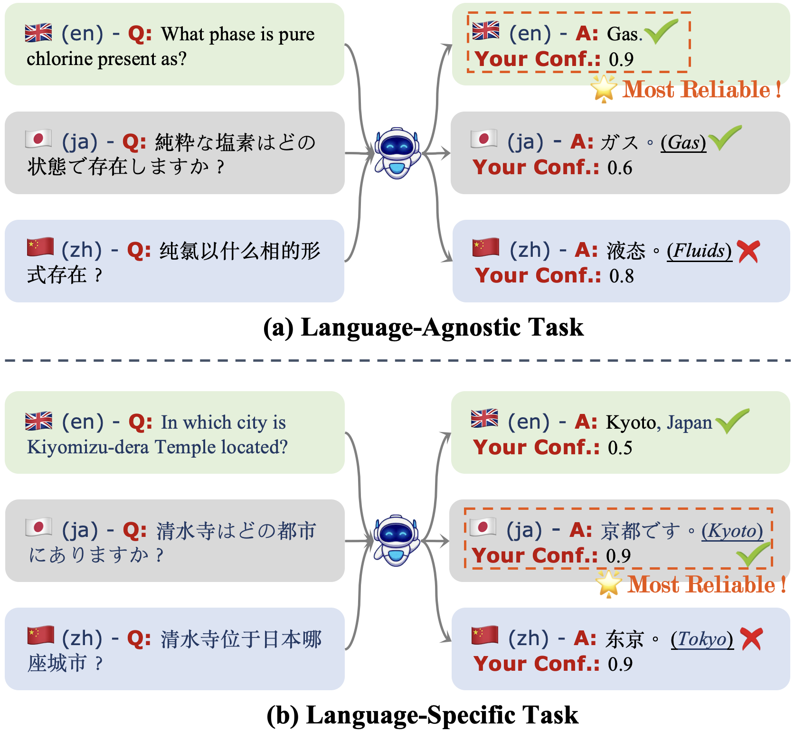
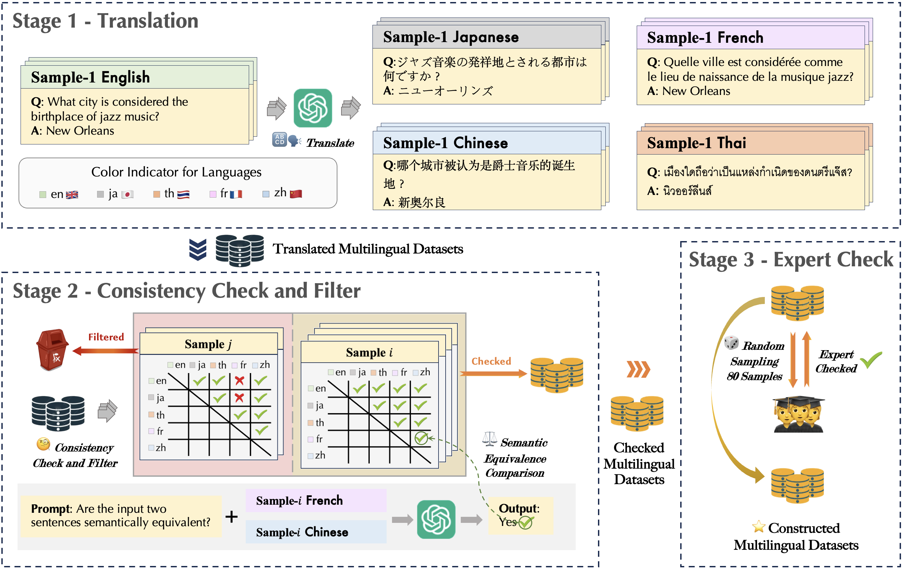

# MlingConf: A Comprehensive Investigation of Multilingual Confidence Estimation for Large Language Models

[📄 [Paper Link](https://arxiv.org/abs/2402.13606)]

This project MlingConf introduce a comprehensive investigation of Multilingual Confidence estimation on LLMs, focusing on both language-agnostic (LA) and languagespecific (LS) tasks to explore the performance and language dominance effects of multilingual confidence estimations on different tasks. 




## Data Construction

The benchmark comprises four meticulously checked and human-evaluate high-quality multilingual datasets for LA tasks and one for the LS task tailored to specific social, cultural, and geographical contexts of a language.
The proposed MlingConf datasets are constructed as follows.



### Translation

```shell
python code/preparation.py --dataset triviaqa

python code/translate.py --stage translate --dataset triviaqa
```

### Consistency Check and Filter

```shell
python code/preparation.py --dataset common

python code/translate.py --stage translate --dataset common
```


## Experiments 

### LLM Inference on MlingConf datasets

```shell
# model_name: [llama3, gpt-3.5, llama2, vicuna]
# dataset: [triviaqa, common, gsm8k, sciq, lsqa]
# max_length: [16, 16, 200, 16, 16]

CUDA_VISIBLE_DEVICES=1 python code/inference.py --model_name llama3 --dataset triviaqa --max_length 16

```

### AUROC, ECE, and Accuracy Evaluation

```shell
# model_name: [llama3, gpt-3.5, llama2, vicuna]
# dataset: [triviaqa, common, gsm8k, sciq, lsqa]
CUDA_VISIBLE_DEVICES=1 python code/confidence.py --model_name llama3 --dataset triviaqa --max_length 48
python code/evaluation.py --model llama3 --dataset triviaqa

```

## Citation

If you need to refer to [this paper](https://arxiv.org/abs/2402.13606), please cite with the bibtex listed blow:
```bibtext
@misc{xue2024comprehensivestudymultilingualconfidence,
      title={A Comprehensive Study of Multilingual Confidence Estimation on Large Language Models}, 
      author={Boyang Xue and Hongru Wang and Rui Wang and Sheng Wang and Zezhong Wang and Yiming Du and Bin Liang and Kam-Fai Wong},
      year={2024},
      eprint={2402.13606},
      archivePrefix={arXiv},
      primaryClass={cs.CL},
      url={https://arxiv.org/abs/2402.13606}, 
}
